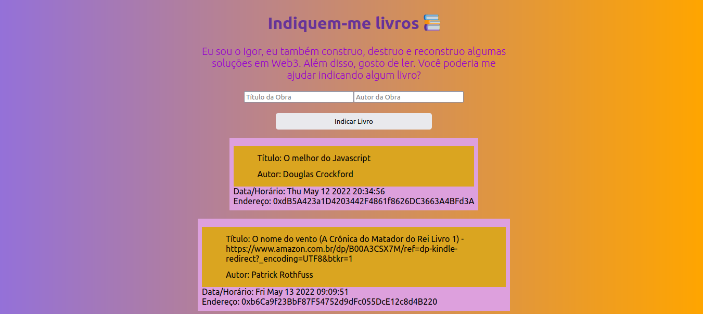

# Indique-me Livros!




> Esta aplicação interaje com um smart contract deployado na testnet Rinkeby. Usuário coloca o título da obra e o nome do autor e finaliza a transação.

> Projeto realizado para o bootcamp da comunidade web3dev, para conhecer o bootcamp [clique aqui](bootcamp.web3dev.com.br/)

## 🚀 Instalando <nome_do_projeto>

Para instalar o <nome_do_projeto>, siga estas etapas:

Linux e macOS:
```
npm run dev
```
Abra http://localhost:3000

## 😄 Conheça a comunidade [web3dev](https://www.web3dev.com.br/)<br>

